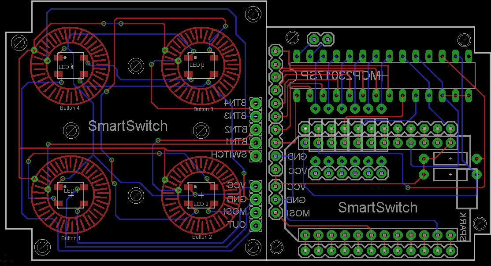

SmartSwitchPCB
==============

Eagle and Gerber Files for the PCB of the SmartSwitch (https://github.com/phhe/spark_smartswitch) with the Spark Core.

## Layout 

### Check Layout
1. Open brd-Layout
2. Tools -> DRC
3. Load
4. Choose 'ITEADstudio_DRC.dru' (ftp://imall.iteadstudio.com/PCBs/ITEADstudio_DRC.zip)
5. Check... 

### Generate Gerbers
1. Open brd-Layout
2. File -> CAM Processor
3. File -> Open --> Job ...
4. Choose 'ITeadstudio_CAM6.cam'  (ftp://imall.iteadstudio.com/PCBs/ITEADstudio_CAM%20for%20Eagle6.x.zip)
5. Execute Job...

## Case

The SmartSwitch Case is for the ButtonPad version of the SmartSwitch.
It is based on a Layout from MakerCase (http://makercase.com) and the Arduinome eXperimenter’s Case (http://interactives.artsrn.ualberta.ca/?page_id=133).

The *.eps file can be ordered at [ponoko.com](http://ponoko.com) or [formulor.de][http://formulor.de]